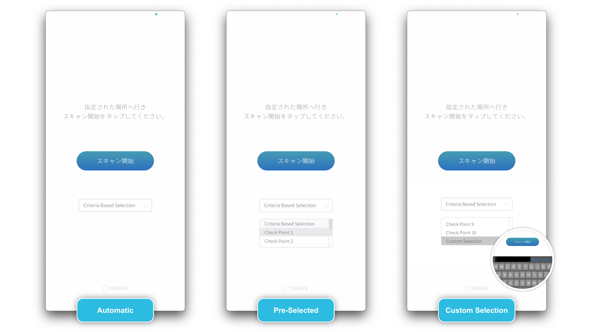

# PLATEAU-PretiaVPS-AR-app

## 1. 概要
本リポジトリでは、Project PLATEAUの令和5年度のユースケース開発業務の一部であるUC23-018「3D都市モデルに最適化したVPSの開発等」について、その成果物である「スマートフォン向けARアプリケーション」のソースコードを公開しています。

「3D都市モデルに最適化したVPS」はPLATEAUの3D都市モデルから生成した点群マップと、スマートフォンで撮影したカメラ画像から生成した点群マップとを比較し、自己位置を推定するシステムです。

##　2. 「3D都市モデルに最適化したVPSの開発等」について
「3D都市モデルに最適化したVPSの開発等」では、PLATEAUの3D都市モデルから生成した点群マップと、スマートフォンで撮影したカメラ画像から生成した点群マップとを比較し、自己位置を推定するシステムを開発しました。

本システムは、PLATEAUの3D都市モデル（LOD3）が整備された沼津の特定エリア(１０箇所)において、アプリケーションで撮影したカメラ画像から生成した点群マップと3D都市モデルから生成した点群マップとを比較し、自己位置を推定する機能に加え、周辺の建物に関連するアイコン(3Dコンテンツ)をAR表示する機能、PLATEAUの3D都市モデルをAR表示する機能（透過度調整可）を実装しています。
本システムは、プレティア・テクノロジーズ株式会社が保有するAR開発プラットフォームPretiaをもとに、簡易的な自己位置推定の精度評価用スマートフォン向けARアプリケーションと合わせて開発されています。

本システムの詳細については
[技術検証レポート](xxxx)を参照してください。

##　3. 利用手順
### 設定

* プロジェクト設定の更新
  * Unityで、File > Build Settingsを選択してください。
  * プラットフォームとしてiOSを選択します。まだインストールされていない場合は、Add Moduleをクリックし、指示に従ってiOSサポートをインストールしてください。
  * Player Settingsをクリックし、Settings for iOSタブで設定をカスタマイズします：
    * Identification（通常、com.yourcompany.yourappのような逆ドメイン名形式）でBundle Identifierを設定します。
    * Build Settingsウィンドウを閉じます。

### ビルド

* Xcode Projectの作成
  * Unity Editorに戻り、Build SettingsウィンドウでBuild And Runをクリックします。Unityがプロジェクトをコンパイルし、Xcodeプロジェクトを作成します。
  * Xcodeプロジェクトを保存する場所を選択し、[Save]をクリックします。
  * ビルドが完了すると、UnityはXcodeプロジェクトを開きます。開かない場合は、保存した場所に移動し、.xcodeprojファイルを開いてください。
* iOS用のビルド
  * XcodeのProject Navigatorでプロジェクトを選択します。正しいターゲットが選択されていることを確認してください。
  * Apple Developerアカウントでサインインします。Xcode > Preferences > Accounts に進み、アカウントを追加します。
  * Signing & Capabilitiesで正しいチームを選択します。
  * iOSデバイスをUSB経由でMacに接続します。
  * Build and Runボタンをクリックします。Xcodeがデバイスにアプリをインストールします。

### アプリの使用方法

#### マップの選択

スキャンを開始するには、まず、メインメニューのドロップダウンメニューから以下のオプションのいずれかを選択してください:

- Criteria-based Location: このオプションは、GPSを利用して現在地から最も近い地図を自動的に検出します。

- Checkpoint Selection: ここでは、1 から 10 までの番号の、あらかじめ組み込まれたオプションのリストから選択できます。地図同士が近すぎる場合など、GPS精度の問題でCriteria-based Locationによるマップの自動選択ができない場合に、この機能を使用して手動で地図を選択します。

- Custom Map Key: 開発者向けにカスタマイズされたロケーションを利用する場合のオプションです。

#### スキャン

スキャンを開始するには、次の手順に従ってください:

- チェックポイントへ移動: 本プロジェクトで指定する沼津市のチェックポイントへ移動してください。

- カメラビューの起動: アプリで「スキャン開始」ボタンをタップし、カメラビューを起動してください。

- カメラを対象の建物に向け静止する: 端末のカメラをチェックポイントの指定された建物に向けて静止してください。

- スキャンの開始: 画面上の丸い赤いボタンを押してスキャンを開始します。

- スキャンの実行: 正確なスキャンのために、建物をカメラのフレーム内に収めることを確認しながら、静止します。数秒経っても画面が遷移しない場合左から右へ、ゆっくりと携帯電話を水平に動かし、再度静止します。

- スキャンの完了 (Reloc) プロセス: スキャン（Reloc）が完了すると、拡張現実（AR）コンテンツが表示される。

#### その他機能

* **オクルージョン**: "オクルージョン"機能によって、ARコンテンツは現実世界と同じように、ビルの後ろや中にあるように見えるリアルな効果を生み出します。
* **コンテンツ位置情報の表示** : この機能は、Plateau SDKから算出したARコンテンツの位置を表示します。ARコンテンツがグローバル座標のどこに配置されているかを表示します。
* **デバイス位置情報の表示** : 画面下部に、あなたのデバイスの座標を2種類表示します：
  * **GPS座標**: GPSで取得したデバイスの位置情報を表示します。
  * **相対座標**: VPSで取得した相対座標とPlateau SDKからデバイスのグローバル座標を算出し表示します。

##　4. システム概要

##　5. 利用技術

##　6. 動作環境

##　7. 本リポジトリのフォルダ構成

##　8. ライセンス

##　9. 注意事項

##　10. 参考資料

## システム要件

### 開発環境

* **Unity Version**: Unity 2021.3.27f1 LTS
* **AR Framework**:
  * AR Foundation 4.2.8
  * ARKit XR Plugin 4.2.9
  * Pretia SDK 0.11.0
* **Supported Unity Editor Platforms**: iOS

### iOS Device Requirements

* **Minimum iOS Version**: iOS 12
* **Supported Devices**: iPhone X or newer

### Software Requirements

* **Xcode Version**: Xcode 15.0.1

## License

**PLATEAU-PretiaVPS-AR-app** is available under the Copyright (C) 2024 Pretia Technologies,inc. See the [LICENSE](LICENSE) file for more info.

## オープンソースへのコントリビュートについて

オープンソースへのコントリビュートに興味をお持ちいただきありがとうございます。以下にコントリビュートに向けた簡易手順を記載します。:

* 環境がプロジェクトの要件を満たしていることを確認します。リポジトリのクローンを作成します。
* 未解決の課題を選択するか、課題を新規作成して変更を提案してください。
* ローカル・リポジトリに、わかりやすい名前で新しいブランチを作成してください。
* プロジェクトのコーディング標準に従って、変更を実装してください。
* ブランチをGitHubにプッシュし、プルリクエストを作成してください。
* 承認されると、管理者があなたの変更を取り込みます。

## 謝辞

本プロジェクトにご協力いただいた全ての方々に深く感謝申し上げます。また、下記CC0による3Dコンテンツを作成してくださったクリエーターの皆様にも深く感謝申し上げます。

- [Cake!!](https://alpha.womp.com/preview/387526) by [Movieinyou](https://alpha.womp.com/profile/f7394afc-6e94-40d4-8bc5-d9014f997e42)
- [Shrimp ramen](https://alpha.womp.com/preview/448890) by [Oleksandra](https://alpha.womp.com/profile/d4b238ac-388e-40ad-88de-05f86d7639f5)
- [CORNUCOPIA](https://alpha.womp.com/preview/91692) by [artlylee](https://alpha.womp.com/profile/6f769f65-bc71-4a9d-8a22-83fd55113874)
- [tooth](https://alpha.womp.com/preview/457979) by [Rulfo](https://alpha.womp.com/profile/4d0c1893-dcbc-4e38-b113-72015c232c7b)
- [China's Food](https://alpha.womp.com/preview/108889) by [Marta Cvetkova](https://alpha.womp.com/profile/c901d31f-adca-4b82-b9c5-575bccd518cf)
- [Sugar cookies](https://alpha.womp.com/preview/92650) by [Speedy](https://alpha.womp.com/profile/97490f3b-9324-477e-9a25-822960196835)
- [Pre-Latte](https://alpha.womp.com/preview/456671) by [JONUNO](https://alpha.womp.com/profile/c94d13a3-c1be-482b-90ab-fa2fe717f377)
- [Glass Vanity](https://alpha.womp.com/preview/157169) by [heizal](https://alpha.womp.com/profile/30808621-65d7-4d30-b63c-eb700d209e33)
- [CARTOON CONE](https://alpha.womp.com/preview/468005) by [Rulfo](https://alpha.womp.com/profile/4d0c1893-dcbc-4e38-b113-72015c232c7b)
- [Golb](https://alpha.womp.com/preview/393543) by [Mr](https://alpha.womp.com/profile/a0d99e2e-e8d1-4706-bed3-37ed842e40b3)
- [Good Tv for sale](https://alpha.womp.com/preview/361870) by [NoodlesCan](https://alpha.womp.com/profile/13d30dc9-9a14-4059-8857-f4d76cd35d56)
- [simple monopoly house](https://alpha.womp.com/profile/639b35af-85cf-4307-93c2-ecec4ffb997c) by [womp_for_3Dprinting](https://alpha.womp.com/profile/639b35af-85cf-4307-93c2-ecec4ffb997c)
- [talking tree](https://alpha.womp.com/preview/391682) by [Benjamin Browning](https://alpha.womp.com/profile/8610fe94-b7b9-4724-8870-3af2c1930da9)
- [Longbush Templa](https://alpha.womp.com/preview/29416) by [Alexandra Stobiecka](https://alpha.womp.com/profile/cabcc539-fefd-458d-a7cd-aa8f18710f6c)
- [CanScene attempt](https://alpha.womp.com/preview/35462) by [Eduardo Gutierréz](https://alpha.womp.com/profile/5c07458f-59aa-4db4-a380-208f27d5df38)
- [Oligastiri](https://alpha.womp.com/preview/46326) by [ssen](https://alpha.womp.com/profile/9cc1fa4b-c647-484e-b74f-ad6709c97429)
- [Bottle 02 v2](https://alpha.womp.com/preview/423803) by [Maxwell Willman](https://alpha.womp.com/profile/d679d2fe-af3f-475b-b0b8-15547e0b0209)
